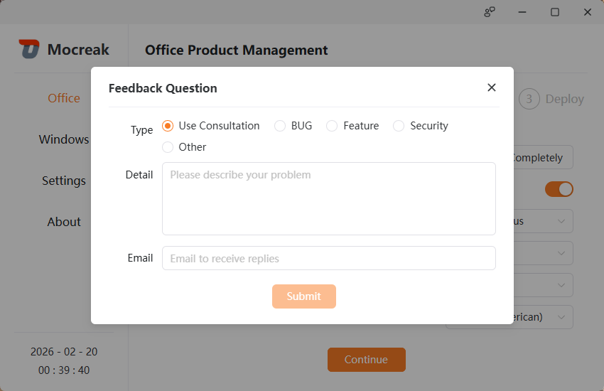
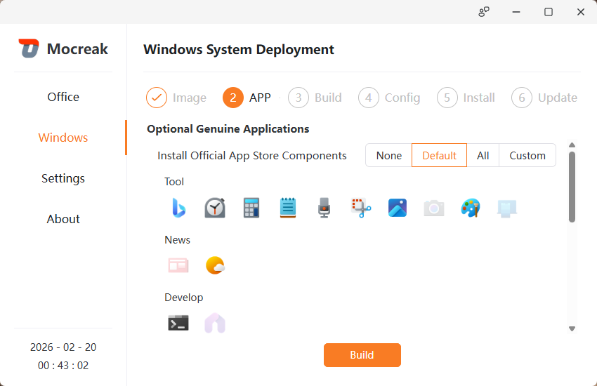
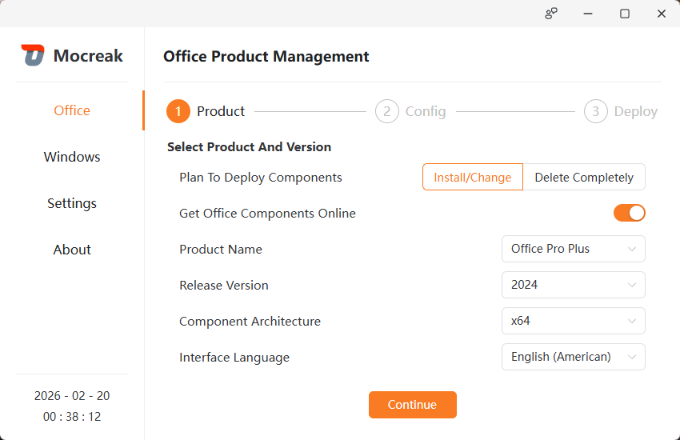

## Mocreak

[English](README.md) | [简体中文](README.zh-CN.md) | [繁體中文](README.zh-TW.md) | [日本語](README.ja.md) | [Русский](README.ru.md) | [Deutsch](README.de.md)

---

<!-- translate:start -->

Mocreak 是一款一键自动化下载、安装、部署正版 Windows 和 Office 的办公增强工具。该工具完全免费、无广告、绿色、无毒、简约、高效、安全。

### ✨ 软件特性
- 全新的现代化图形界面。支持明/暗双色主题、适配多国家/地区语言，助您提升部署效率。

- 完善的反馈系统，帮助您定位、寻找部署时遇到的问题，并第一时间响应解决方案。

    #### 🪟 Windows
    
    - 可自定义选择安装 Windows 11 x64 的各种发行版本。
    - 支持将多个国家或地区的语言作为新系统的默认语言。
    - 支持“在线下载安装”和“脱机安装” Windows 操作系统。
    - 可高度自定义需要安装的系统自定义组件，甚至你可以选择不安装 Windows Defender、Notepad 等。
    - 基于原生编译模式，按需构造适配您计算机的 Windows 操作系统，大幅改善系统稳定性和兼容性。
    - 安装 Windows 期间除了必要的重启外，您仍可继续使用电脑办公。
    - 对于不符合 TPM、CPU、内存 等硬件配置的计算机，实施兼容策略，确保安装顺利进行。
    - 安装后，无需配置复杂的计算机设置，可直接使用本地账户登录计算机。

    #### 🏢 Office
    
    - 一键快速下载、安装、部署最新 Office 2016、2019、2021、2024 版软件。
    - 支持将 Office 安装到其它分区，包括：固态硬盘、机械盘、可移动磁盘、闪盘、内存盘等。
    - 可任意组合安装 Word、PPT、Excel、Outlook、OneNote、Access、Visio、Project、OneDrive、Lync/Skype 等组件。
    - 支持将多个国家或地区的语言作为 Office 界面语言。
    - 安装 Office 前，软件会自动检测冲突的 Office 组件，并对其进行卸载。
    - 支持“在线下载安装”和“脱机安装”双策略安装 Office 组件。
    - 可使用本工具用于“完全删除 Office 组件”场景，在不需要 Office 时彻底清除。

### 🚀 运行&测试
- 为确保运行稳定，本软件支持在 Windows 10 及以上版本的 x64 系统架构下运行。
- 软件已在多个 Windows 系统版本的 x64 系统进行了测试，运行正常、稳定。

### 📦 适用场景
- 未经开发者正式书面同意，任何人、企业、机构等，不得采用任何直接或间接的方式将本产品商业化，本产品作者有权追究违反者的一切法律责任。
- 本工具仅限非盈利条件下，基于个人学习、研究或者欣赏 Windows、Office 软件之用，不可用作其他用途。
- 严禁任何人、企业、机构等通过非法手段破解/反编译本软件。

### 🔒 版权保护
- 软件已获多项著作权（含修改保护）：软著登字第12752724号、软著登字第13022732号等。

### 📖 关于
- 如有建议、疑惑等，您可以发邮件至 OdysseusYuan@foxmail.com 交流探讨。
- © 2024 - 2026 mocreak.com. All Rights Reserved.

<!-- translate:end -->